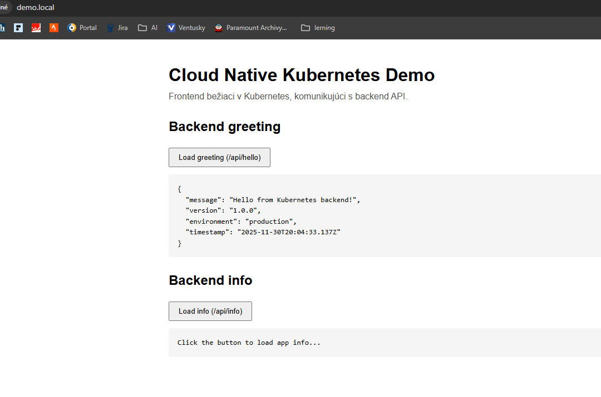
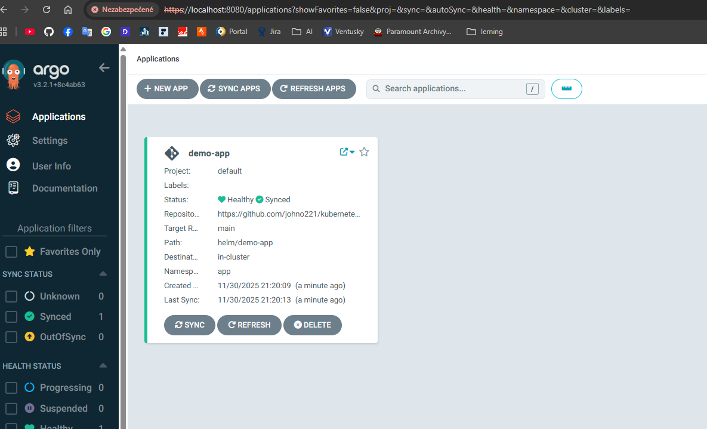
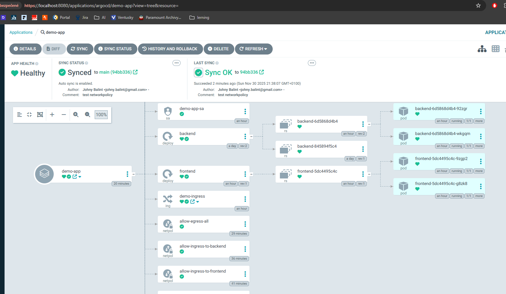

# kubernetescl-ocud-native-stack
Production-ready cloud native environment for a frontend + backend application on Kubernetes with GitOps, CI/CD, security, and monitoring.

# docker build, test and push to GitHub registry
cd apps/backed
docker build -t demo-backend:local .
docker run --rm -p 8080:8080 demo-backend:local
http://localhost:8080/health
http://localhost:8080/api/hello
http://localhost:8080/api/info
http://localhost:8080/metrics

cd apps/frontend
docker build -t demo-frontend:local .
docker run --rm -p 8081:80 demo-frontend:local
http://localhost:8081

# tag
docker tag demo-backend:local ghcr.io/johno221/demo-backend:1.0.0

docker tag demo-frontend:local ghcr.io/johno221/demo-frontend:1.0.0

# push to registry 

docker push ghcr.io/johno221/demo-backend:1.0.0
docker push ghcr.io/johno221/demo-frontend:1.0.0

# helm 
cd ~/kubernetes-cloud-native-stack/helm/demo-app

helm install demo-app . \
  --namespace app \
  --create-namespace

# test template
helm template demo-app helm/demo-app

# nstavenie host name 
wsl - 172.25.233.201   demo.local
alebo cez poweshell 

$ip = "172.25.233.201"
$domain = "demo.local"
$line = "$ip`t$domain"
Add-Content -Path "C:\Windows\System32\drivers\etc\hosts" -Value $line

# gitops 

kubectl create namespace argocd
kubectl apply -n argocd -f https://raw.githubusercontent.com/argoproj/argo-cd/stable/manifests/install.yaml
kubectl get pods -n argocd

# overit a forward port 

kubectl port-forward svc/argocd-server -n argocd 8080:443

# heslo: 
kubectl -n argocd get secret argocd-initial-admin-secret \
  -o jsonpath="{.data.password}" | base64 -d; echo

